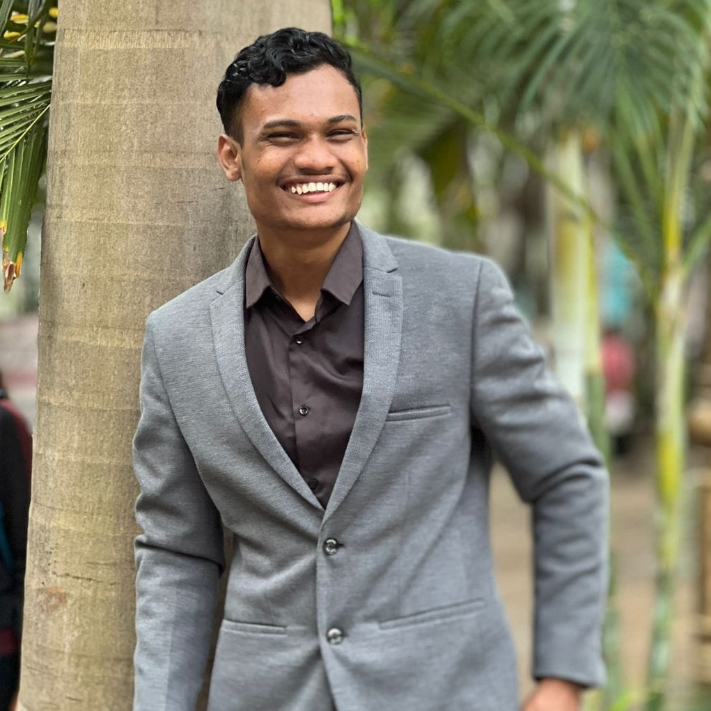
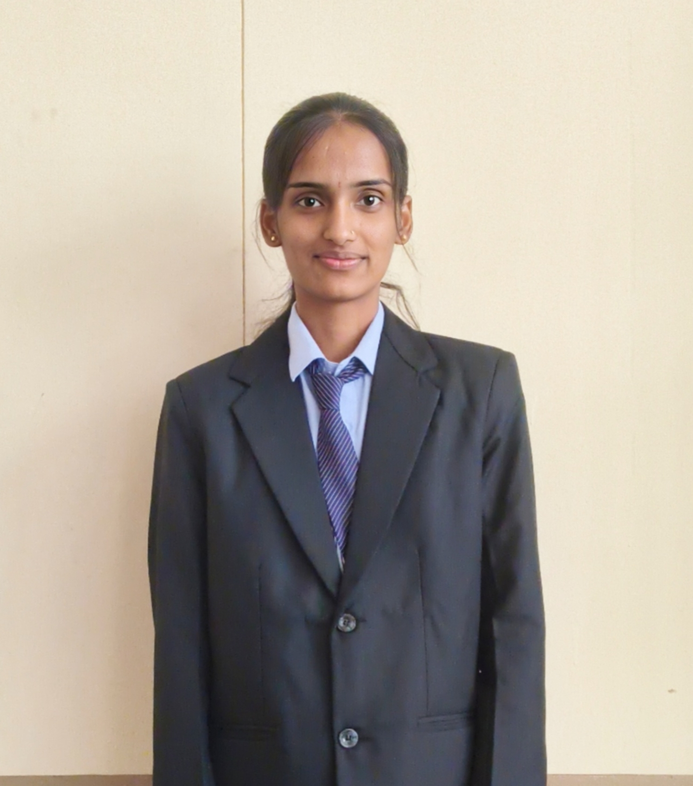
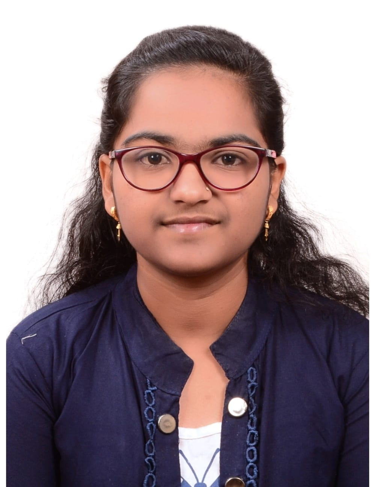
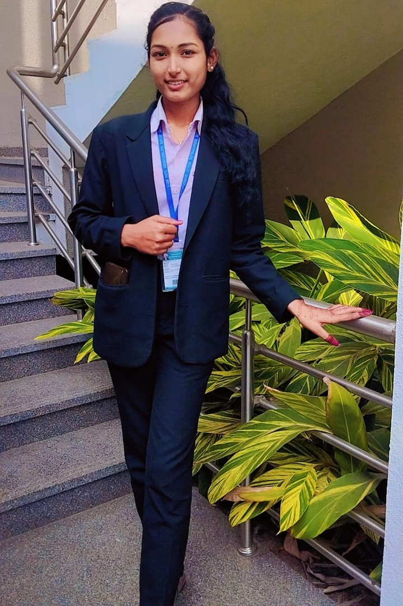
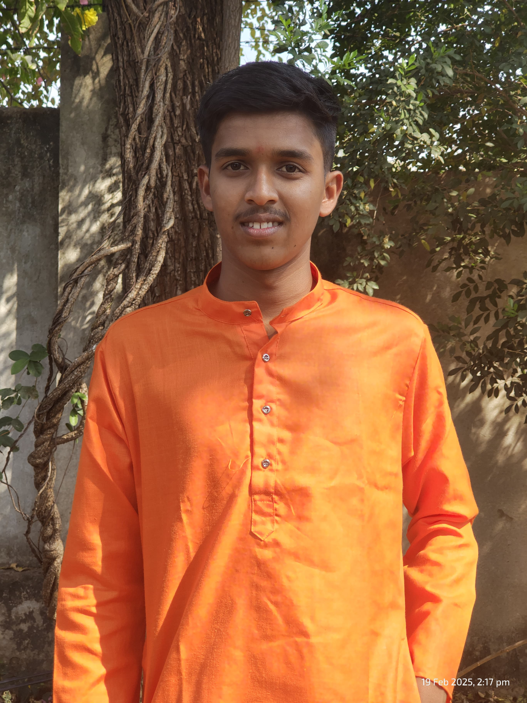
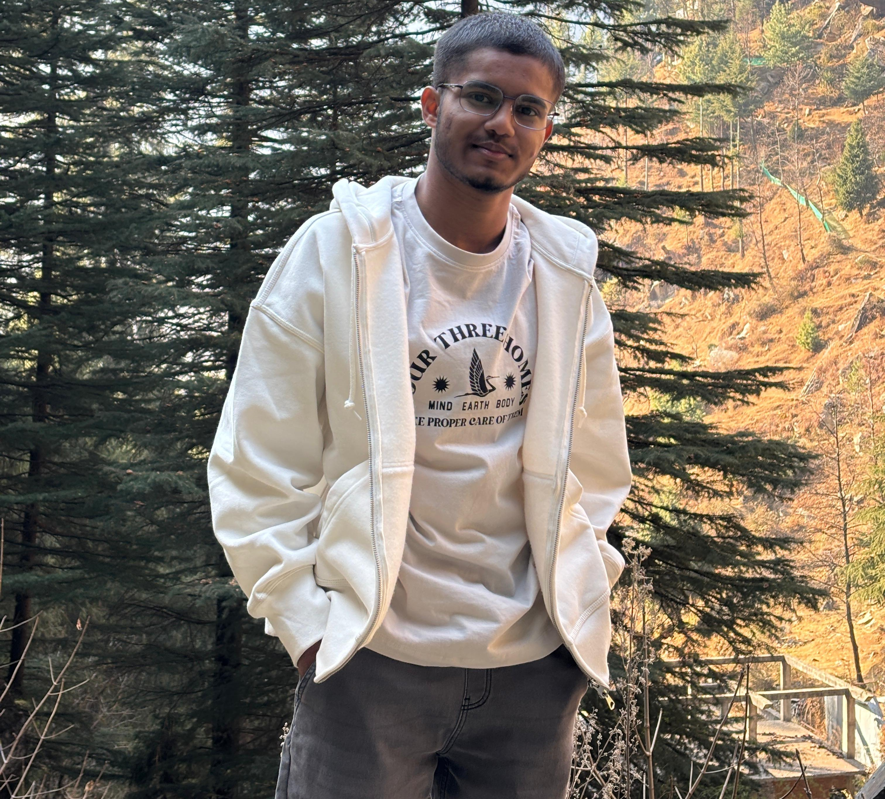

# Bhartiya Virasat – The Indian Heritage 🇮🇳

**Bhartiya Virasat** is a simple and meaningful web-based project dedicated to exploring and celebrating India's rich and diverse heritage. It brings together the timeless stories, teachings, and achievements of Indian gods, saints, warriors, philosophers, scientists, and freedom fighters, and presents them in a visually appealing and easy-to-understand format.

This project is inspired by the idea of keeping India's cultural soul alive in the hearts of every generation. From epic tales in the Ramayana and Mahabharata to historical figures like Rani Lakshmibai and Maharana Pratap, and from spiritual leaders like Swami Vivekananda and Guru Nanak to ancient minds like Aryabhatta and Panini—this website is a digital tribute to those who have shaped India's identity.

## 🌸 What You’ll Find

The homepage welcomes users with the idea of "India's Living Heritage" and invites them to explore multiple categories:

- **Divine Tales** – Stories and symbolism of Indian gods and goddesses such as Lord Shiva, Krishna, Durga, Ganesha, and others.
- **Legends of the Land** – Historical heroes who fought with bravery and led with honor.
- **Ancient Minds** – Indian mathematicians, scientists, and thinkers who contributed to global knowledge.
- **Spiritual Souls** – Saints and spiritual teachers whose wisdom continues to inspire millions.
- **Unsung Freedom Fighters** – Brave men and women who contributed to India’s independence but are often forgotten.
- **New Legacy** – Modern inspirational Indians who continue to build the nation with courage, creativity, and dedication.

## 🎯 Purpose of This Project

The main goal of Bhartiya Virasat is to create awareness, spark curiosity, and instill pride in Indian heritage. It is designed especially for students, young explorers, and anyone who wants to reconnect with India’s glorious past in a simple, beautiful way.

The website uses storytelling, images, and a clean layout to make learning about Indian legends fun and engaging. It is made with love, not as a technical product, but as a cultural bridge—where history meets inspiration.

## 📖 Language & Simplicity

Currently, the content is available in **English**, and plans are in place to add **Hindi** to reach more people across the country. The entire layout is kept **simple**, **mobile-friendly**, and **easy to navigate**.

## 💡 Future Possibilities

- Add more inspiring personalities and stories from different Indian regions.
- Include short videos or voice narrations for accessibility.
- Add interactive quizzes or facts to engage younger audiences.
- Allow user contributions or suggestions for new legends and sections.
- Translate content into more Indian languages.

## ©️ Copyright

© 2025 Bhartiya Virasat. All rights reserved. This platform is created with deep respect for Indian heritage and culture. All images and information are used for educational and cultural purposes only.

---

## 🙏 Final Message

*Bhartiya Virasat is not just a project—it is a tribute to the spirit of Bharat. It reminds us where we came from, what we stand for, and how our stories can shape a brighter future. Jai Hind! 🇮🇳*

## Our Team 

